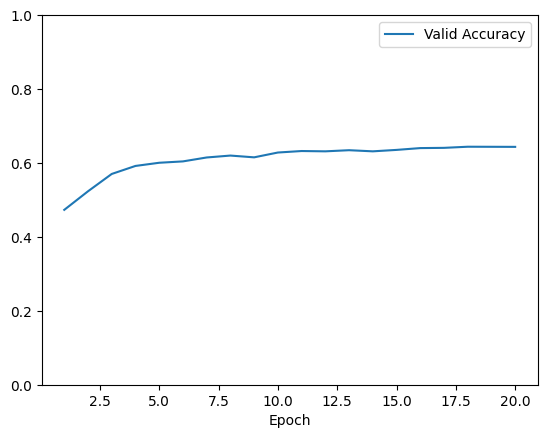

# Question 1

## Q1.1

### Q1.1a
The final accuracy was of `0.3422`, while the train accuracy was `0.4654` and the validation accuracy of `0.4610`.

### Q1.1b
The final accuracy for learning rate = 0.01 was of `0.5784`, while the train accuracy was `0.6609` and the validation accuracy of `0.6568`.

The final accuracy for learning rate = 0.001 was of `0.5936`, while the train accuracy was `0.6625` and the validation accuracy of `0.6639`.

## Q1.2

### Q1.2a
This statement is true. In terms of expressiveness, a logistic regression model is a linear model while a multi-layer perceptron using relu isn't. This means that logistic regression can at most create a linear frontier, while a mlp using relu is capable of of defining non linear frontiers.
On terms of ease of training, logistic regrission wins due to the fact that is convex, meaning that there is only one global solution and the solution is able to converge into it. Meanwhile, in a MLP using relu, the optimization is not convex.

### Q1.2b
The final accuracy was of `0.4726`, while the train accuracy was `0.4722` and the validation accuracy of `0.4721`.

# Question 2

## Q2.1
The best configuration is with a learning rate equals to `0.01` with a final test accuracy of `0.6030`, a validation accuracy of `0.6436` annd a training loss of `0.9827`.

## Q2.2

### Q2.2a
Batch size of `16` took `2.219s` sys time and got a final test accuracy of `0.7618`, while a batch size of `1024` took `0.778s` sys time and got a final test accuracy of `0.6975`.
Meaning that a batch size of `16` got a better performance but took longer to train. Havin a training loss of `0.5549` and a valid accuracy of `0.7960`.

### Q2.2b
The learning rate that got the best test accuracy was a learning rate of `0.1` with a test accuracy of `0.7618`.

The best validation accuracy was `0.7960` for a learning rate of `0.1` and the worst one was `0.3435` for a learning rate of `1`. Having the following graphs:

### Q2.2c
Running a batch size of `256` with `150` epochs resulted in a training loss of `0.3164`, a validation accuracy of `0.8428` and a test accuracy of `0.7713`. Since there doesn't seem to be a decrease in validation accuracy in favor of a increase in test accuracy, there doesn't seem to be overfitting.
Setting L2 regularization to `0.0001` yelded the best validation accuracy of `0.8444` and having a dropout probability of `0.2` got the worst validation accuracy of `0.8342`. Having the graphs:

